# How the IT Due Diligence Agent Works

> **For anyone who wants to understand what this tool does and how data flows through it.**

---

## What Is This Tool?

This is an AI-powered analysis tool for IT due diligence in M&A deals. You give it documents about a target company's IT environment (spreadsheets, Word docs, PDFs). It extracts the facts, identifies risks, and tells you what it all **means** for the deal—not just what exists, but the "so what."

**Key Philosophy:** We are the "brain on top"—we analyze and provide insights. We don't compete on data extraction; we make the data meaningful.

---

## Level 1: The 30-Second Version

```mermaid
flowchart LR
    A[📄 Documents] --> B[🤖 AI Analysis] --> C[📊 Insights Report]

    style A fill:#e0f2fe
    style B fill:#fef3c7
    style C fill:#dcfce7
```



**That's it.**

- **Input:** Files about the target company (Excel inventories, IT assessments, org charts)
- **Processing:** AI reads, extracts facts, identifies patterns, flags risks
- **Output:** Report that tells leadership what matters and why

---

## Level 2: The Data Journey


### What Happens at Each Step:

| Step | What It Does | Example |
|------|--------------|---------|
| **Parse & Extract** | Reads files, pulls out tables and text | Excel sheet → rows of applications |
| **Detect Type** | Figures out what kind of data it is | "These columns look like an application inventory" |
| **Store in Inventory** | Saves structured data with stable IDs | `I-APP-0f2c01: Salesforce CRM` |
| **AI Discovery** | Finds facts from unstructured text | "They mention mainframe migration is planned" |
| **AI Reasoning** | Analyzes facts to find risks and implications | "Mainframe + no plan = Day 1 risk" |

---

## Level 3: Processing Stages


### Stage Details:

#### Stage 1: Ingestion
**Goal:** Get data into the system reliably

- **File Router** - Detects file type (Excel, Word, MD, CSV), routes to correct parser
- **Type Detector** - Looks at column headers to determine inventory type (application, infrastructure, org, vendor)
- **Schema Validator** - Checks required fields exist, warns about missing data

**Key Point:** This is DETERMINISTIC (no AI). Same input = same output. 100% reliable.

#### Stage 2: Enrichment
**Goal:** Add context to raw inventory data

- **Inventory Store** - Holds all items with content-based IDs (same item always gets same ID)
- **LLM Lookup** - AI looks up what each application is ("Duck Creek = insurance policy admin platform")
- **Flag Unknowns** - If AI doesn't recognize something, flag it for investigation (don't guess)

**Key Point:** AI only adds info when confident. Unknown = flagged, not fabricated.

#### Stage 3: Discovery
**Goal:** Extract facts from unstructured content (prose, notes, narratives)

- **Discovery Agents** - Domain-specific AI agents (infrastructure, security, applications, etc.)
- **Fact Store** - Holds extracted facts with evidence quotes
- **Gap Detection** - Identifies what's MISSING (no DR plan mentioned, no org chart provided)

**Key Point:** Every fact has an evidence quote. No hallucination—show your work.

#### Stage 4: Reasoning
**Goal:** Turn facts into insights—the "so what"

- **Reasoning Agents** - Analyze facts in context of the deal
- **Risk Analysis** - Identify risks with severity, mitigation, supporting facts
- **Work Items** - Concrete actions needed, phased (Day 1, Day 100, Post-100), with cost estimates

**Key Point:** Every finding MUST cite facts. No unsupported conclusions.

#### Stage 5: Reporting
**Goal:** Present insights in a way leadership can use

- **So What Report** - Findings first, data second
- **Data Flow Diagrams** - Visual representation of system connectivity
- **Appendix Data** - Supporting inventory tables for reference

**Key Point:** Lead with "so what," support with evidence.

---

## Level 4: Agent Architecture


### Two Types of Agents:

| Agent Type | Model | Purpose | Cost |
|------------|-------|---------|------|
| **Discovery** | Haiku (fast) | Extract facts from text | ~$0.01/doc |
| **Reasoning** | Sonnet (smart) | Analyze facts, find insights | ~$0.05/domain |

### Why Two Phases?

1. **Discovery is extraction** - Needs to be thorough but not brilliant
2. **Reasoning is analysis** - Needs to be smart, see patterns, understand context
3. **Separation prevents contamination** - Facts are locked before reasoning starts

---

## Level 5: Individual Agent Deep Dive

### Discovery Agent Example: Applications


**What the Applications Discovery Agent Does:**

1. Receives document text + existing inventory
2. Searches for application-related information
3. For each finding:
   - Creates a FACT with evidence quote
   - Or flags a GAP if info is missing
4. Continues until document is exhausted
5. Calls `complete` when done

**Example Fact Created:**
```json
{
  "fact_id": "F-APP-001",
  "domain": "applications",
  "category": "erp",
  "item": "SAP S/4HANA",
  "details": {
    "users": 500,
    "deployment": "on-premises",
    "criticality": "critical"
  },
  "evidence": {
    "exact_quote": "SAP S/4HANA serves as our core ERP platform with approximately 500 active users",
    "source_section": "IT Infrastructure Overview"
  }
}
```

### Reasoning Agent Example: Applications


**What the Applications Reasoning Agent Does:**

1. Receives all application facts + deal context (carve-out? acquisition?)
2. Analyzes patterns:
   - Cost concentration
   - Vendor lock-in
   - Integration complexity
   - Technical debt
3. Creates RISKS with:
   - Severity rating
   - Mitigation approach
   - Supporting fact citations
4. Creates WORK ITEMS with:
   - Phase (Day 1, Day 100, Post-100)
   - Cost estimate
   - Owner (buyer/target/shared)

**Example Risk Created:**
```json
{
  "finding_id": "R-APP-001",
  "title": "High ERP Concentration Risk",
  "description": "SAP S/4HANA handles 80% of business transactions with heavy customization",
  "severity": "high",
  "so_what": "Migration or replacement would cost $2-4M and take 18-24 months",
  "mitigation": "Negotiate extended TSA, begin assessment immediately",
  "citing_facts": ["F-APP-001", "F-APP-003", "F-APP-007"]
}
```

---

## Summary: The Complete Picture


**The Key Insight:**

We are not a data extraction tool. We are the **brain on top**.

- ToltIQ extracts data → We analyze it
- Documents contain facts → We find the "so what"
- Inventory is data → Insights are value

**What makes this different:**
1. Lead with insights, not data
2. Every finding cites evidence
3. Diagrams you can validate in calls
4. Designed for M&A context, not generic IT assessment

---

*Document created: January 2026*
*For questions: Ask the person who gave you this tool*
