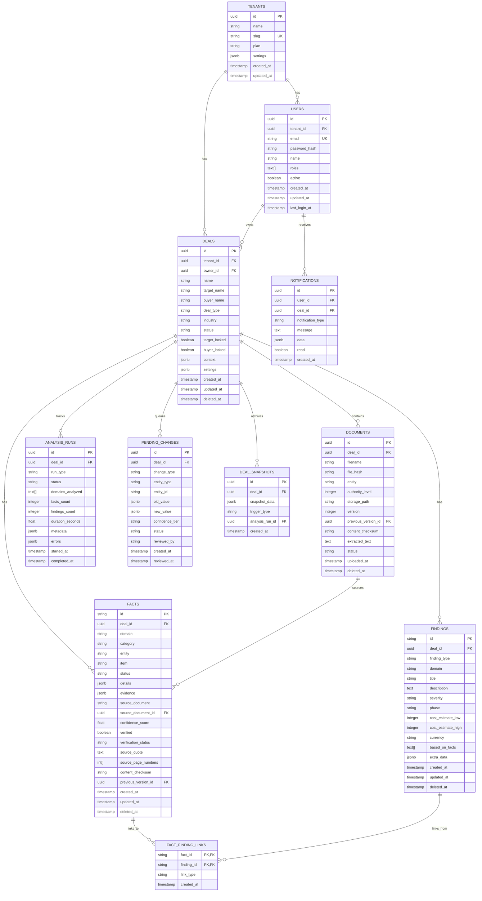

# Database Entity Relationship Diagram

## Overview

The IT Diligence Agent uses PostgreSQL for persistent data storage. The schema supports multi-tenancy, soft deletes, and full audit trails.

## Entity Relationship Diagram (Mermaid)



## Table Summary

| Table | Description | Key Relationships |
|-------|-------------|-------------------|
| `tenants` | Organizations/customers | Parent of users and deals |
| `users` | System users | Belongs to tenant, owns deals |
| `deals` | Due diligence deals | Central entity, owns all analysis data |
| `documents` | Uploaded documents | Belongs to deal, sources facts |
| `facts` | Extracted facts | Belongs to deal, linked to findings |
| `findings` | Risks, work items, recommendations | Belongs to deal, linked to facts |
| `fact_finding_links` | Many-to-many junction | Links facts to findings |
| `analysis_runs` | Analysis execution records | Tracks deal analysis history |
| `pending_changes` | Merge queue for changes | Queues incremental updates |
| `deal_snapshots` | Point-in-time snapshots | Archives deal state |
| `notifications` | User notifications | User alerts and updates |

## Key Design Decisions

### 1. Soft Deletes
All core entities use soft deletes (`deleted_at` timestamp) to preserve data integrity and enable recovery.

### 2. Audit Columns
`created_by` and `updated_by` columns track who made changes.

### 3. Version Tracking
Documents and facts have `previous_version_id` for change history.

### 4. JSONB for Flexible Data
`details`, `evidence`, `metadata`, and `settings` use JSONB for schema flexibility.

### 5. Full-Text Search
Facts table has a GIN index on `item` and `source_quote` for efficient search.

### 6. Normalized Fact-Finding Links
Junction table allows many-to-many relationships with link type metadata.

## Indexes

```sql
-- Full-text search on facts
CREATE INDEX idx_facts_fulltext ON facts USING gin(
    to_tsvector('english', item || ' ' || COALESCE(source_quote, ''))
);

-- Common query patterns
CREATE INDEX idx_facts_deal_domain ON facts(deal_id, domain);
CREATE INDEX idx_findings_deal_type ON findings(deal_id, finding_type);
CREATE INDEX idx_documents_deal_hash ON documents(deal_id, file_hash);
CREATE INDEX idx_pending_changes_status ON pending_changes(deal_id, status);
```

## Data Flow

```
1. User creates Deal
   └── Deal assigned to Tenant and User

2. Documents uploaded to Deal
   └── Stored with hash for deduplication
   └── Version tracked if replaced

3. Analysis run executed
   └── AnalysisRun record created
   └── Facts extracted from documents
   └── Findings generated from facts
   └── FactFindingLinks created

4. Incremental updates
   └── PendingChanges queued
   └── Human review and approval
   └── Facts/Findings updated

5. Snapshot created
   └── DealSnapshot preserves state
   └── Can restore or compare
```
