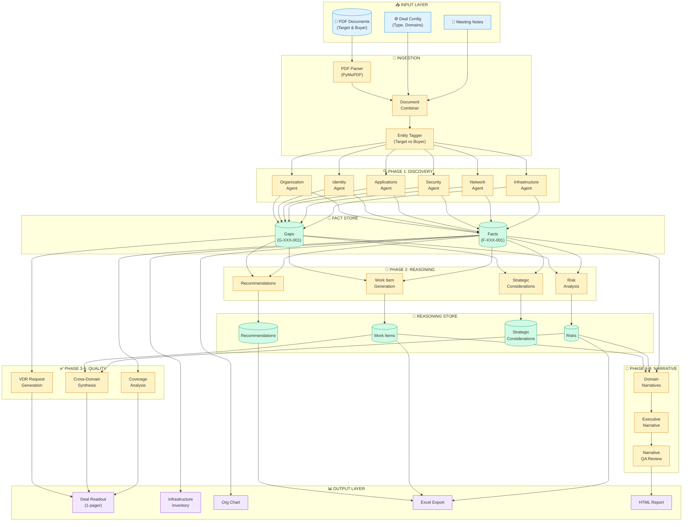

# End-to-End Pipeline: IT Due Diligence Agent

## Overview Diagram



---

## Simplified Linear View

```
┌─────────────┐     ┌─────────────┐     ┌─────────────┐     ┌─────────────┐     ┌─────────────┐
│   INGEST    │────▶│  DISCOVER   │────▶│   REASON    │────▶│   REFINE    │────▶│   OUTPUT    │
│             │     │             │     │             │     │             │     │             │
│ • PDFs      │     │ • Extract   │     │ • Analyze   │     │ • Coverage  │     │ • Readout   │
│ • Notes     │     │   Facts     │     │   Risks     │     │ • Synthesis │     │ • Inventory │
│ • Config    │     │ • Flag      │     │ • Generate  │     │ • VDR       │     │ • Reports   │
│             │     │   Gaps      │     │   Work Items│     │ • Narrative │     │ • Excel     │
└─────────────┘     └─────────────┘     └─────────────┘     └─────────────┘     └─────────────┘
                          │                   │                   │
                          ▼                   ▼                   ▼
                    ┌───────────┐       ┌───────────┐       ┌───────────┐
                    │ FactStore │       │ Reasoning │       │  Quality  │
                    │           │       │   Store   │       │  Scores   │
                    │ • Facts   │       │ • Risks   │       │ • Coverage│
                    │ • Gaps    │       │ • WorkItems│      │ • Flags   │
                    └───────────┘       │ • Recs    │       └───────────┘
                                        └───────────┘
```

---

## Model & Cost Breakdown

| Phase | Model | Est. Cost | Parallelization |
|-------|-------|-----------|-----------------|
| Discovery (6 domains) | Haiku | ~$0.05-0.10 | Yes (6 parallel) |
| Reasoning (6 domains) | Sonnet | ~$0.30-0.50 | Yes (6 parallel) |
| Coverage | Rules | $0 | N/A |
| Synthesis | Sonnet | ~$0.05-0.10 | No |
| VDR Generation | Rules + Haiku | ~$0.02 | No |
| Narratives (6 domains) | Sonnet | ~$0.20-0.30 | Yes (6 parallel) |
| Executive Narrative | Sonnet | ~$0.05-0.10 | No |
| **Total** | | **~$0.70-1.20** | |

---

## Key Data Objects

### Fact (from Discovery)
```json
{
  "fact_id": "F-INFRA-001",
  "domain": "infrastructure",
  "category": "cloud",
  "item": "AWS is primary cloud provider",
  "details": {"provider": "AWS", "regions": ["us-east-1"]},
  "status": "documented",
  "evidence": {"exact_quote": "...", "source_section": "..."},
  "entity": "target"
}
```

### Gap (from Discovery)
```json
{
  "gap_id": "G-SEC-001",
  "domain": "cybersecurity",
  "category": "compliance",
  "description": "No SOC 2 certification mentioned",
  "importance": "high"
}
```

### Risk (from Reasoning)
```json
{
  "finding_id": "R-INFRA-001",
  "domain": "infrastructure",
  "title": "Legacy ERP Dependency",
  "description": "...",
  "severity": "high",
  "mitigation": "...",
  "based_on_facts": ["F-APP-003", "F-INFRA-007"]
}
```

### Work Item (from Reasoning)
```json
{
  "finding_id": "W-IAM-001",
  "domain": "identity_access",
  "title": "SSO Integration",
  "description": "...",
  "phase": "Day_100",
  "cost_estimate": "50k_to_100k",
  "triggered_by": ["G-IAM-002"],
  "triggered_by_risks": ["R-IAM-001"]
}
```
