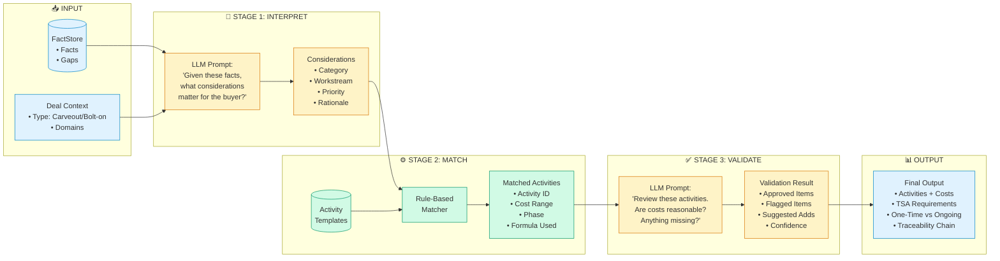

# Three-Stage Cost Estimation Architecture

## Overview

The buyer activity and cost estimation uses a hybrid LLM + Rules approach to balance flexibility with consistency.

```
┌────────────────────────────────────────────────────────────────────────────────────┐
│                         THREE-STAGE REASONING PIPELINE                              │
├────────────────────────────────────────────────────────────────────────────────────┤
│                                                                                    │
│   ┌──────────────┐      ┌──────────────┐      ┌──────────────┐                    │
│   │   STAGE 1    │      │   STAGE 2    │      │   STAGE 3    │                    │
│   │              │      │              │      │              │                    │
│   │  LLM INTERPRETS     │  RULES MATCH │      │ LLM VALIDATES│                    │
│   │   (~$0.15)   │─────▶│    ($0)      │─────▶│   (~$0.15)   │                    │
│   │              │      │              │      │              │                    │
│   └──────────────┘      └──────────────┘      └──────────────┘                    │
│          │                    │                     │                              │
│          ▼                    ▼                     ▼                              │
│   "What do these       "Match to activity    "Does this make                      │
│    facts MEAN?"         templates & costs"    sense? Flag issues"                 │
│                                                                                    │
└────────────────────────────────────────────────────────────────────────────────────┘
```

---

## Detailed Stage Breakdown



---

## Stage 1: LLM Interpretation

**Purpose:** Translate raw facts into buyer-relevant considerations

```
┌─────────────────────────────────────────────────────────────────┐
│ INPUT                                                           │
├─────────────────────────────────────────────────────────────────┤
│ Facts:                                                          │
│   F-IAM-001: "SSO via parent's Okta tenant"                    │
│   F-IAM-002: "200 users in Active Directory"                   │
│   F-INFRA-003: "Email on parent's O365"                        │
│                                                                 │
│ Deal Type: Carveout                                            │
└─────────────────────────────────────────────────────────────────┘
                              │
                              ▼
┌─────────────────────────────────────────────────────────────────┐
│ LLM REASONING                                                   │
├─────────────────────────────────────────────────────────────────┤
│ "These facts indicate parent dependencies that must be         │
│  severed. The buyer will need standalone identity and          │
│  email infrastructure. 200 users suggests mid-market scope."   │
└─────────────────────────────────────────────────────────────────┘
                              │
                              ▼
┌─────────────────────────────────────────────────────────────────┐
│ OUTPUT: Considerations                                          │
├─────────────────────────────────────────────────────────────────┤
│ [                                                               │
│   {                                                             │
│     "id": "C-001",                                              │
│     "category": "parent_dependency",                           │
│     "workstream": "identity",                                  │
│     "description": "SSO separation from parent Okta",          │
│     "priority": "critical",                                    │
│     "rationale": "Day 1 blocker - users can't authenticate",  │
│     "based_on_facts": ["F-IAM-001"]                            │
│   },                                                            │
│   {                                                             │
│     "id": "C-002",                                              │
│     "category": "parent_dependency",                           │
│     "workstream": "email",                                     │
│     "description": "Email migration from parent O365",         │
│     "priority": "high",                                        │
│     "based_on_facts": ["F-INFRA-003"]                          │
│   }                                                             │
│ ]                                                               │
└─────────────────────────────────────────────────────────────────┘
```

---

## Stage 2: Rules-Based Matching

**Purpose:** Map considerations to activity templates with market-anchored costs

```
┌─────────────────────────────────────────────────────────────────┐
│ ACTIVITY TEMPLATES (Excerpt)                                    │
├─────────────────────────────────────────────────────────────────┤
│ parent_dependency:                                              │
│   identity:                                                     │
│     - id: "sso_standup"                                        │
│       name: "Standalone SSO Implementation"                    │
│       cost_base: [75000, 150000]                               │
│       cost_per_user: [25, 50]                                  │
│       phase: "Day_1"                                           │
│       tsa_candidate: true                                      │
│       tsa_duration: [1, 3] months                              │
│                                                                 │
│   email:                                                        │
│     - id: "email_migration"                                    │
│       name: "Email Migration to Standalone Tenant"             │
│       cost_base: [50000, 100000]                               │
│       cost_per_user: [35, 70]                                  │
│       phase: "Day_100"                                         │
│       tsa_candidate: true                                      │
│       tsa_duration: [3, 6] months                              │
└─────────────────────────────────────────────────────────────────┘
                              │
                              ▼
┌─────────────────────────────────────────────────────────────────┐
│ MATCHING LOGIC                                                  │
├─────────────────────────────────────────────────────────────────┤
│ For each Consideration:                                         │
│   1. Look up templates[category][workstream]                   │
│   2. Apply quantitative context (user_count = 200)             │
│   3. Calculate cost range:                                      │
│      low  = base_low + (user_count × per_user_low)             │
│      high = base_high + (user_count × per_user_high)           │
└─────────────────────────────────────────────────────────────────┘
                              │
                              ▼
┌─────────────────────────────────────────────────────────────────┐
│ OUTPUT: Matched Activities                                      │
├─────────────────────────────────────────────────────────────────┤
│ [                                                               │
│   {                                                             │
│     "activity_id": "sso_standup",                              │
│     "name": "Standalone SSO Implementation",                   │
│     "consideration_id": "C-001",                               │
│     "cost_low": 80000,    // 75k + (200 × $25)                │
│     "cost_high": 160000,  // 150k + (200 × $50)               │
│     "phase": "Day_1",                                          │
│     "tsa_required": true,                                      │
│     "tsa_months": [1, 3],                                      │
│     "formula": "base + (users × per_user)"                     │
│   },                                                            │
│   {                                                             │
│     "activity_id": "email_migration",                          │
│     "name": "Email Migration to Standalone Tenant",            │
│     "consideration_id": "C-002",                               │
│     "cost_low": 57000,    // 50k + (200 × $35)                │
│     "cost_high": 114000,  // 100k + (200 × $70)               │
│     "phase": "Day_100",                                        │
│     "tsa_required": true,                                      │
│     "tsa_months": [3, 6]                                       │
│   }                                                             │
│ ]                                                               │
│                                                                 │
│ TOTALS:                                                         │
│   Cost Range: $137,000 - $274,000                              │
│   TSA Services: 2 (identity, email)                            │
└─────────────────────────────────────────────────────────────────┘
```

---

## Stage 3: LLM Validation

**Purpose:** Sanity check the outputs, flag anomalies, suggest missing items

```
┌─────────────────────────────────────────────────────────────────┐
│ VALIDATION PROMPT                                               │
├─────────────────────────────────────────────────────────────────┤
│ "Review these activities for a 200-user carveout:              │
│                                                                 │
│  1. SSO Standup: $80k-$160k (Day 1)                           │
│  2. Email Migration: $57k-$114k (Day 100)                      │
│                                                                 │
│  Original facts: [F-IAM-001, F-IAM-002, F-INFRA-003]          │
│                                                                 │
│  Questions:                                                     │
│  - Are these costs reasonable for the scope?                   │
│  - Is anything obviously missing?                              │
│  - Are the phases appropriate?"                                │
└─────────────────────────────────────────────────────────────────┘
                              │
                              ▼
┌─────────────────────────────────────────────────────────────────┐
│ OUTPUT: Validation Result                                       │
├─────────────────────────────────────────────────────────────────┤
│ {                                                               │
│   "approved": ["sso_standup", "email_migration"],              │
│   "flagged": [],                                                │
│   "suggested_additions": [                                      │
│     {                                                           │
│       "description": "AD migration or new directory standup",  │
│       "rationale": "F-IAM-002 mentions AD but no activity",   │
│       "estimated_impact": "medium"                             │
│     }                                                           │
│   ],                                                            │
│   "cost_reasonableness": "appropriate",                        │
│   "phase_assessment": "Day 1 SSO is correct priority",        │
│   "confidence": 0.85,                                          │
│   "notes": "Consider adding AD standup activity"               │
│ }                                                               │
└─────────────────────────────────────────────────────────────────┘
```

---

## Cost Model Summary

| Mode | Stages Run | LLM Cost | Use Case |
|------|------------|----------|----------|
| **FAST** | 1 + 2 | ~$0.15 | Quick iterations, drafts |
| **VALIDATED** | 1 + 2 + 3 | ~$0.30 | Standard analysis |
| **ENHANCED** | 1 + 2 + 3 + Summary | ~$0.50 | Client delivery |

---

## Traceability Chain

Every cost estimate traces back to source:

```
┌─────────────┐     ┌─────────────┐     ┌─────────────┐     ┌─────────────┐
│   SOURCE    │────▶│    FACT     │────▶│CONSIDERATION│────▶│  ACTIVITY   │
│  DOCUMENT   │     │             │     │             │     │             │
│             │     │ F-IAM-001   │     │ C-001       │     │ sso_standup │
│ "SSO via    │     │ SSO via     │     │ SSO must be │     │ $80k-$160k  │
│  parent     │     │ parent Okta │     │ separated   │     │ Day 1       │
│  Okta"      │     │             │     │             │     │             │
└─────────────┘     └─────────────┘     └─────────────┘     └─────────────┘
     │                   │                   │                    │
     └───────────────────┴───────────────────┴────────────────────┘
                              │
                     FULL AUDIT TRAIL
```

---

## Why This Architecture?

| Challenge | How Three-Stage Solves It |
|-----------|---------------------------|
| LLM costs vary wildly | Stage 2 uses $0 rules for cost calc |
| LLM might hallucinate costs | Costs come from vetted templates |
| Need domain expertise | Templates encode market knowledge |
| Still need flexibility | Stage 1 LLM handles novel situations |
| Need quality control | Stage 3 catches errors |
| Must be auditable | Full fact → activity traceability |
