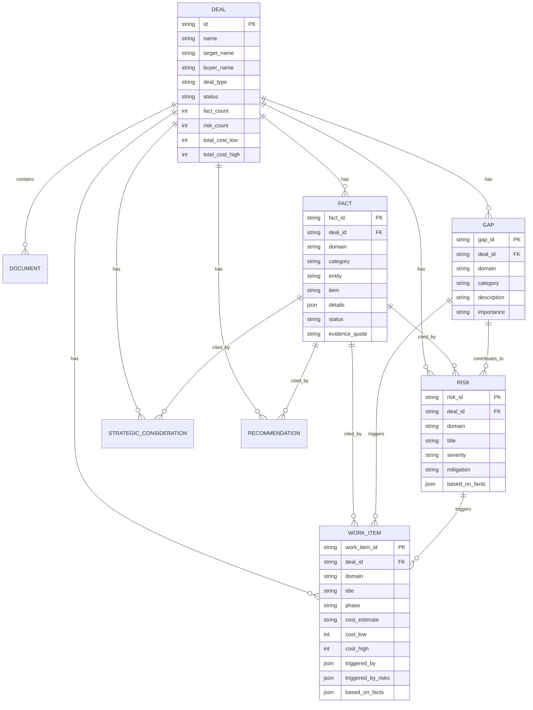

# Data Store Architecture

## Overview

The system uses two primary data stores that maintain explicit linkages for full traceability.

```
┌─────────────────────────────────────────────────────────────────────────────────┐
│                           DATA ARCHITECTURE                                      │
├─────────────────────────────────────────────────────────────────────────────────┤
│                                                                                 │
│   ┌─────────────────────────────┐       ┌─────────────────────────────┐        │
│   │        FACT STORE           │       │      REASONING STORE        │        │
│   │      (Discovery Output)     │       │     (Analysis Output)       │        │
│   ├─────────────────────────────┤       ├─────────────────────────────┤        │
│   │                             │       │                             │        │
│   │  ┌───────┐    ┌───────┐   │       │  ┌───────┐    ┌───────┐    │        │
│   │  │ Facts │    │ Gaps  │   │──────▶│  │ Risks │    │ Work  │    │        │
│   │  │       │    │       │   │       │  │       │    │ Items │    │        │
│   │  └───────┘    └───────┘   │       │  └───────┘    └───────┘    │        │
│   │                             │       │                             │        │
│   │                             │       │  ┌───────┐    ┌───────┐    │        │
│   │                             │       │  │Strat. │    │ Recs  │    │        │
│   │                             │       │  │Consid.│    │       │    │        │
│   │                             │       │  └───────┘    └───────┘    │        │
│   │                             │       │                             │        │
│   └─────────────────────────────┘       └─────────────────────────────┘        │
│                                                                                 │
│                    ▼                                   ▼                        │
│            ┌─────────────────────────────────────────────────┐                 │
│            │              SQLite DATABASE                     │                 │
│            │         (Persistent Deal Storage)                │                 │
│            └─────────────────────────────────────────────────┘                 │
│                                                                                 │
└─────────────────────────────────────────────────────────────────────────────────┘
```

---

## Entity Relationship Diagram



---

## Linkage Model: Facts → Findings

Every finding traces back to source facts:

```
┌─────────────────────────────────────────────────────────────────────────────────┐
│                         TRACEABILITY LINKAGES                                    │
└─────────────────────────────────────────────────────────────────────────────────┘

                              FACT STORE
    ┌─────────────────────────────────────────────────────────────┐
    │                                                             │
    │  F-INFRA-001 ─────┐                                        │
    │  "AWS hosting"    │                                        │
    │                   │                                        │
    │  F-INFRA-002 ─────┼──┐                                     │
    │  "No DR plan"     │  │                                     │
    │                   │  │                                     │
    │  F-IAM-001 ───────┼──┼──┐                                  │
    │  "Parent SSO"     │  │  │                                  │
    │                   │  │  │                                  │
    │  G-SEC-001 ───────┼──┼──┼──┐                               │
    │  "No SOC 2"       │  │  │  │                               │
    │                   │  │  │  │                               │
    └───────────────────┼──┼──┼──┼───────────────────────────────┘
                        │  │  │  │
                        ▼  ▼  ▼  ▼

                         REASONING STORE
    ┌─────────────────────────────────────────────────────────────┐
    │                                                             │
    │  ┌─────────────────────────────────────────────────────┐   │
    │  │ RISK: R-INFRA-001                                   │   │
    │  │ "Business Continuity Risk"                          │   │
    │  │ Severity: HIGH                                      │   │
    │  │ based_on_facts: [F-INFRA-001, F-INFRA-002]         │◀──┼───── Links to facts
    │  └─────────────────────────────────────────────────────┘   │
    │                        │                                    │
    │                        │ triggers                           │
    │                        ▼                                    │
    │  ┌─────────────────────────────────────────────────────┐   │
    │  │ WORK ITEM: W-INFRA-001                              │   │
    │  │ "Implement DR Strategy"                             │   │
    │  │ Phase: Day_100                                      │   │
    │  │ Cost: $150k - $300k                                 │   │
    │  │ triggered_by_risks: [R-INFRA-001]                  │◀──┼───── Links to risks
    │  │ based_on_facts: [F-INFRA-002]                      │◀──┼───── Links to facts
    │  └─────────────────────────────────────────────────────┘   │
    │                                                             │
    │  ┌─────────────────────────────────────────────────────┐   │
    │  │ WORK ITEM: W-IAM-001                                │   │
    │  │ "SSO Separation"                                    │   │
    │  │ Phase: Day_1                                        │   │
    │  │ Cost: $75k - $150k                                  │   │
    │  │ triggered_by: [G-SEC-001]                          │◀──┼───── Links to gaps
    │  │ based_on_facts: [F-IAM-001]                        │◀──┼───── Links to facts
    │  └─────────────────────────────────────────────────────┘   │
    │                                                             │
    └─────────────────────────────────────────────────────────────┘
```

---

## Data Object Schemas

### FactStore Objects

```python
@dataclass
class Fact:
    fact_id: str          # "F-INFRA-001" - unique identifier
    domain: str           # "infrastructure", "network", etc.
    category: str         # "cloud", "hosting", "backup_dr"
    item: str             # Human-readable description
    details: dict         # Structured data (vendor, version, etc.)
    status: str           # "documented", "inferred", "unclear"
    evidence: dict        # {exact_quote, source_section}
    entity: str           # "target" or "buyer"

@dataclass
class Gap:
    gap_id: str           # "G-SEC-001"
    domain: str
    category: str
    description: str      # What information is missing
    importance: str       # "critical", "high", "medium", "low"
```

### ReasoningStore Objects

```python
@dataclass
class Risk:
    finding_id: str           # "R-INFRA-001"
    domain: str
    category: str
    title: str
    description: str
    severity: str             # "critical", "high", "medium", "low"
    mitigation: str
    reasoning: str
    integration_dependent: bool
    based_on_facts: List[str] # ["F-INFRA-001", "F-INFRA-002"]
    confidence: str

@dataclass
class WorkItem:
    finding_id: str           # "W-IAM-001"
    domain: str
    title: str
    description: str
    phase: str                # "Day_1", "Day_100", "Post_100"
    priority: str
    owner_type: str           # "buyer", "seller", "joint"
    cost_estimate: str        # "under_25k", "25k_to_50k", etc.
    reasoning: str
    triggered_by: List[str]       # Gap IDs: ["G-SEC-001"]
    triggered_by_risks: List[str] # Risk IDs: ["R-INFRA-001"]
    based_on_facts: List[str]     # Fact IDs: ["F-IAM-001"]
    confidence: str

@dataclass
class StrategicConsideration:
    finding_id: str           # "S-APP-001"
    domain: str
    title: str
    description: str
    lens: str                 # "valuation", "integration", "risk"
    implication: str
    based_on_facts: List[str]
    confidence: str

@dataclass
class Recommendation:
    finding_id: str           # "REC-ORG-001"
    domain: str
    title: str
    description: str
    action_type: str          # "negotiate", "budget", "investigate"
    urgency: str              # "pre-close", "day_1", "post-close"
    rationale: str
    based_on_facts: List[str]
```

---

## Database Schema (SQLite)

```sql
-- Core deal record
CREATE TABLE deals (
    id TEXT PRIMARY KEY,
    name TEXT NOT NULL,
    target_name TEXT NOT NULL,
    buyer_name TEXT,
    deal_type TEXT NOT NULL,      -- 'carve_out', 'bolt_on', 'platform'
    status TEXT DEFAULT 'active',
    fact_count INTEGER DEFAULT 0,  -- Denormalized for fast display
    risk_count INTEGER DEFAULT 0,
    total_cost_low INTEGER DEFAULT 0,
    total_cost_high INTEGER DEFAULT 0,
    created_at TEXT DEFAULT CURRENT_TIMESTAMP
);

-- Facts with evidence linkage
CREATE TABLE facts (
    id TEXT PRIMARY KEY,
    deal_id TEXT REFERENCES deals(id),
    fact_id TEXT NOT NULL,         -- "F-INFRA-001"
    domain TEXT NOT NULL,
    category TEXT NOT NULL,
    entity TEXT DEFAULT 'target',
    item TEXT NOT NULL,
    details TEXT DEFAULT '{}',     -- JSON
    evidence_quote TEXT,
    evidence_section TEXT,
    UNIQUE(deal_id, fact_id)
);

-- Work items with full linkage
CREATE TABLE work_items (
    id TEXT PRIMARY KEY,
    deal_id TEXT REFERENCES deals(id),
    work_item_id TEXT NOT NULL,    -- "W-IAM-001"
    domain TEXT NOT NULL,
    title TEXT NOT NULL,
    phase TEXT NOT NULL,
    cost_low INTEGER,
    cost_high INTEGER,
    triggered_by TEXT DEFAULT '[]',       -- JSON array of gap IDs
    triggered_by_risks TEXT DEFAULT '[]', -- JSON array of risk IDs
    based_on_facts TEXT DEFAULT '[]',     -- JSON array of fact IDs
    UNIQUE(deal_id, work_item_id)
);

-- Indexes for fast lookups
CREATE INDEX idx_facts_deal ON facts(deal_id);
CREATE INDEX idx_facts_domain ON facts(deal_id, domain);
CREATE INDEX idx_work_items_deal ON work_items(deal_id);
```

---

## Query Patterns

### "What facts support this risk?"
```python
risk = reasoning_store.get_risk("R-INFRA-001")
supporting_facts = [
    fact_store.get_fact(fid)
    for fid in risk.based_on_facts
]
# Returns: [Fact(F-INFRA-001), Fact(F-INFRA-002)]
```

### "What work items does this gap trigger?"
```python
gap_id = "G-SEC-001"
triggered_items = [
    wi for wi in reasoning_store.work_items
    if gap_id in wi.triggered_by
]
# Returns: [WorkItem(W-IAM-001), WorkItem(W-SEC-003)]
```

### "Show full lineage for a cost estimate"
```python
work_item = reasoning_store.get_work_item("W-IAM-001")

lineage = {
    "work_item": work_item.title,
    "cost": f"${work_item.cost_low:,} - ${work_item.cost_high:,}",
    "triggered_by_gaps": work_item.triggered_by,
    "triggered_by_risks": work_item.triggered_by_risks,
    "source_facts": [
        fact_store.get_fact(fid).item
        for fid in work_item.based_on_facts
    ]
}
# Returns full audit trail from cost → fact → document
```

---

## Data Flow Summary

```
┌──────────────┐
│  DOCUMENTS   │
│  (PDFs)      │
└──────┬───────┘
       │ parse & extract
       ▼
┌──────────────┐     ┌──────────────┐
│    FACTS     │────▶│    GAPS      │
│ (what we     │     │ (what we     │
│  know)       │     │  don't know) │
└──────┬───────┘     └──────┬───────┘
       │                    │
       │ analyze            │ triggers
       ▼                    ▼
┌──────────────┐     ┌──────────────┐
│    RISKS     │────▶│ WORK ITEMS   │
│ (what could  │     │ (what to do) │
│  go wrong)   │     │              │
└──────────────┘     └──────┬───────┘
                           │
                           ▼
                    ┌──────────────┐
                    │    COSTS     │
                    │ (what it     │
                    │  will cost)  │
                    └──────────────┘
```
